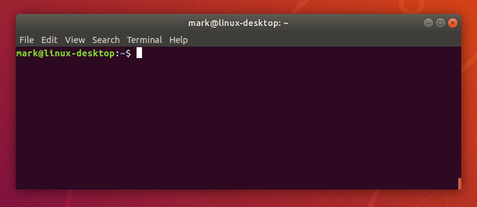

# Importance in Programming
{: .no_toc }

## Table of contents
{: .no_toc .text-delta }

1. TOC
{:toc}

---

## The Command Line

A command-line interpreter (CLI) is a text-based interface to interact with the computer. Rather than clicking through a series of user interfaces, someone using CLI may navigate their computer's file system more efficiently. Assuming the user has achieved a basic understanding of navigation commands, the lower overhead of a purely text-based interface as opposed to a visual one makes the CLI faster. 

Troubleshooting for many low-level applications must be done through CLI. Additionally, a CLI may be used to automate tasks more easily than through a GUI. 

It should be noted that in an effort to draw developers to their platform, both Microsoft and Apple have added CLI analogues to their respective platforms. Windows has the command shell and powershell, while MacOS has the terminal applications. They are designed to mimic the Linux terminal, with many of the commands being similar or identical. MacOS is Unix based, so it is the most similar to Linux. 

The main difference is that Windows and MacOS have both designed their command lines around their GUI. At a surface level, they function similarly to Linux. However, in many cases features are gated behind using their GUI and you are forced to leave the command line anyway. That is not to say they have no use: both Apple and Microsoft have made great efforts in developing the functionality of their CLI. 

---

## Customization

Depending on which distribution you end up using, it may be more or less straightforward to customize your experience. It is difficult to give specific information on the level of customization an average user may do since different distributions have different features. However, since every distribution is open source it is ultimately still possible to change anything with enough know-how.

Out of the box, many Linux distributions offer some kind of customization for icons and desktop themes. Additionally, you may swap around or even design you own custom window managers, desktop environments, and widgets. 

Here are a couple examples from high-level users on r/unixporn:

posted by u/Axarva27

posted by u/Schneegans

---

## Superior Tools

Because Linux is free and open-source, the bar to entry is very low. Customization options enable developers to streamline their workflow and increase output. Additionally, since Linux is open source it is generally easier to make tools for.

For the aforementioned reasons and many more, software developers have flocked to Linux and built their own free developer tools. Generally speaking, many developer tools for proprietary operating systems like Windows are created by their own publishers (although many publishers are beginning to adopt open source). 

As a result, the sheer volume and quality of Linux developer tools is much higher than other operating systems. If you have run into a problem, there are very good odds that someone else has run into the issue and built their own developer tool for it. 

---

## Control over the Computer

In general, most proprietary operating systems were designed with the average consumer in mind. Because of this, many features that developers need to access are typically locked behind miles of red tape and UI designed to obfuscate anything even remotely dangerous to the computer. 

In contrast, Linux was made by software developers for software developers. Nothing is hidden from the user: every kind of setting or option is available from the command line with just a few commands

This kind of transparency also makes it significantly easier to brick your own computer. Fortunately, Linux makes it easier to make and restore from backups.  

