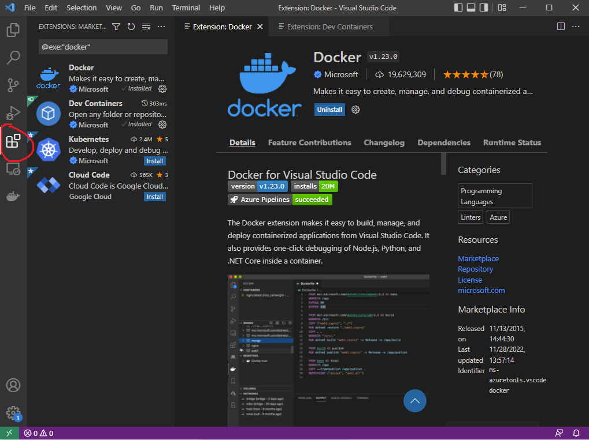
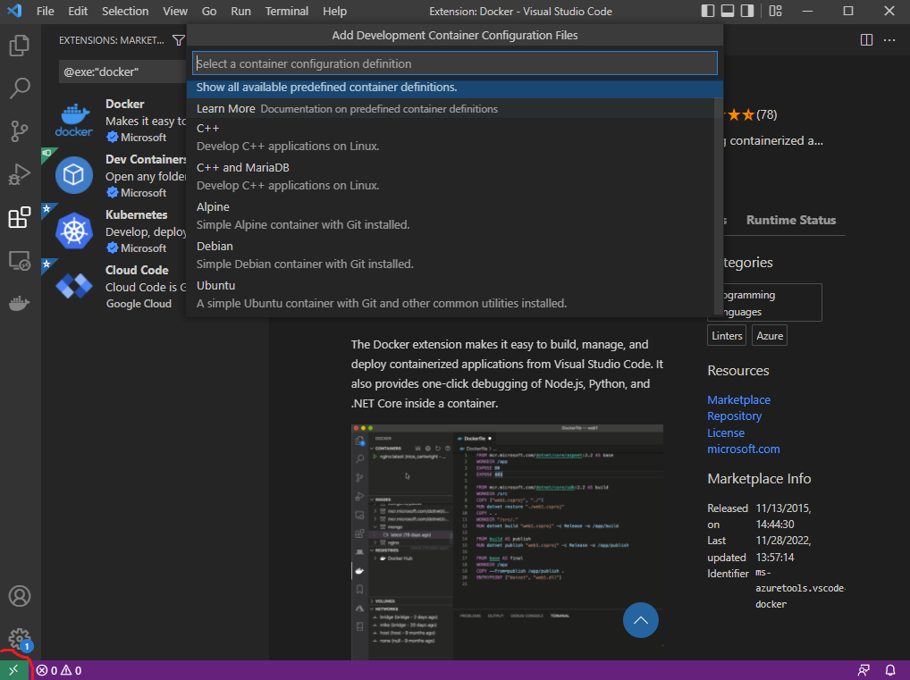
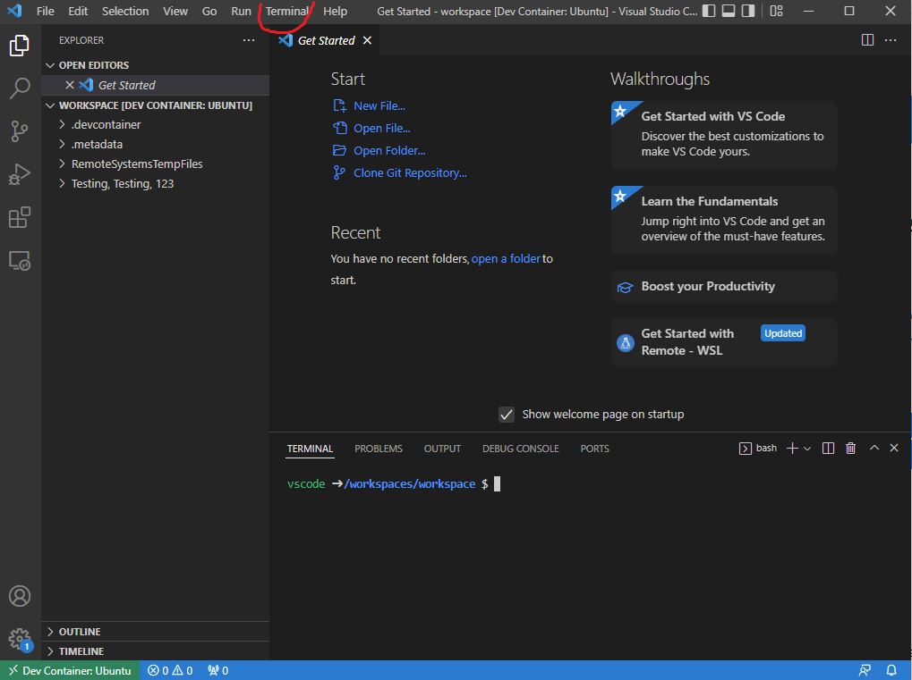

# VSCode Development Container
{: .no_toc }

## Table of contents
{: .no_toc .text-delta }

1. TOC
{:toc}

---

## What is a Container?

A container is essentailly an entire runtime environment: an application, its dependencies, and libraries. They are a form of operating system virtualization. It can be helpful to conceptualize them as miniature virtual machines, with much of the functionality stripped away.

Usually, these are used to package software so that it may run reliablely on any computer. However, we may repurpose them as a full-featured development environment with access to the usual Linux command-line tools. 

---

## Requirements

You will need to install [docker] desktop and [visual studio code] respectively. 

---

## Steps

### Install VSCode Docker Extensions

Launch both docker and VSCode. You may be prompted to install recommended docker extensions, but if not you should click the extensions tab on the left to install the "Docker" and "Dev Container" extensions.

---

### Open Folder in Remote in Container

With the two extensions installed, you can click the icon in the very bottom left, which will open a new menu. Then, click "open folder in container". Select the root folder of a project you want to develop in. You will be presented with a few options, but most can be ignored with the exception of the first one. Be sure to select Ubuntu for this tutorial, but feel free to experiment with the other options later.

---

### Access the Container's Terminal

Now that your container has launched, you can open a terminal window for access to a Linux command line and all its associated tools. Keep in mind that since this is a container, most Linux tools will need to be installed manually through apt-get. Additionally, containers are unsuitable for certain projects like web development since containers have no browser. 

---

## Alternative Guides

You can check out official guides for development containers from either the [VSCode] or [Docker] websites.

[docker]: https://www.docker.com/products/docker-desktop/
[visual studio code]: https://code.visualstudio.com/ 
[VSCode]: https://code.visualstudio.com/docs/devcontainers/containers
[Docker]: https://docs.docker.com/desktop/dev-environments/create-dev-env/

