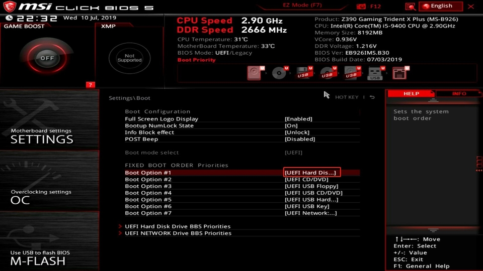

# Booting from a Flashdrive
{: .no_toc }

## Table of contents
{: .no_toc .text-delta }

1. TOC
{:toc}

---

## The Boot-Up Process

BIOS, which stands for basic input/output system, is what's used to start up a computer after it's turned on. After verifying the computer's hardware to confirm booting is possible, the BIOS searches for a boot loader on a storage device such as a hard disk. When a boot loader is found, the BIOS hands over control to the software found. 

This is how operating systems are found and loaded by your computer's hardware. In fact, by opening the BIOS menu during startup you can change which storage devices the BIOS searches for first. By loading a USB with a different operating system, we can then change the BIOS to search the USB first and boot from there.

I strongly recommend following the other guides unless you specifically want to run Linux on your computer and not on top of another operating system. There is no standardized process or software for this due to differences in hardware, so this guide may be difficult for beginners. Additionally, you will be required to burn an ISO of your Linux distribution to a USB.

---

## Requirements

You will need to download [ubuntu] desktop and have a USB drive with at least 8GB of storage. Additionally, you will need to install a utility for your existing operating system for formatting and creating bootable flash drives.

---

## Steps

### Burn the ISO to your flashdrive

Using a disk utility of your choice, you will need to burn the ISO you downloaded from the ubuntu website to your USB. I recommend checking out Rufus, an open-source utility for creating bootable USBs. 

---

### Enter BIOS Setup

Restart your computer and enter the BIOS menu by pressing the appropriate keys on startup. The computer should display which keys you need to press, which are usually F2 or F12. This changes depending on your hardware.

---

### Select the USB to be first in the boot sequence. 

After you've successfully opened the BIOS startup menu, you will need to locate the boot section. Then, you will need to modify the boot order so that it searches the USB where you burned the ISO to first. 

Here is an example of the BIOS menu on a MSI motherboard. Yours will likely not look exactly like this, but the basic steps are the same. 

---

## Alternative Guides

You can check an official guide for creating a bootable USB from the [Ubuntu] website. Note that the guide is for Ubuntu, so while the basic steps are the same the details will differ depending on your hardware. 

[Ubuntu]: https://ubuntu.com/tutorials/create-a-usb-stick-on-ubuntu#1-overview
[ubuntu]: https://ubuntu.com/download/desktop
