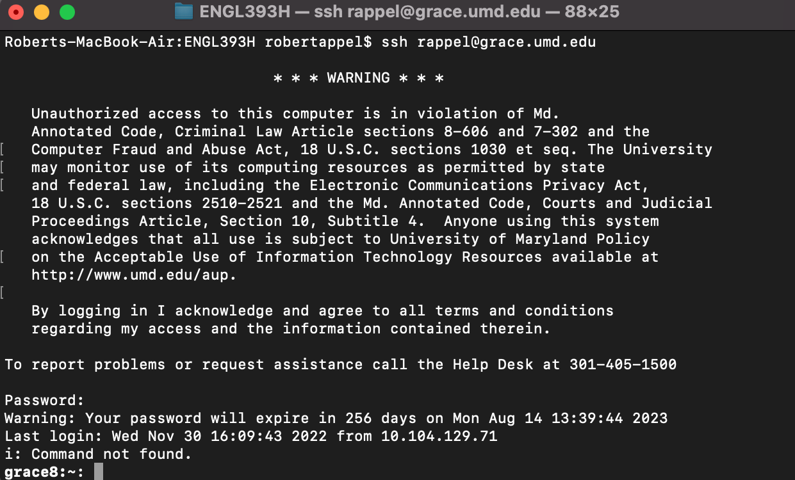

# UMD's Grace Server
{: .no_toc }

## Table of contents
{: .no_toc .text-delta }

1. TOC
{:toc}

---

## What is a Linux Server?

A Linux server is a server built on the Linux operating system. They are widely used today, and are popular due to their stability and flexibility. While the actual details of running a Linux server are outside the scope of this guide, UMD students are given access to a Unix-based server called Grace. Grace is used as an introduction to the command line and as a development tool.

---

## Requirements

Be enrolled as a UMD computer science student, or otherwise have access to an available Linux server. Access to the Grace server depends on your enrollment in certain courses, so you may not have access.

---

## Steps

### Download an SSH Client for your Operating System

On MacOS, you already have access to SSH through the terminal application. Simply launch it and move on to the next step. For Windows, you will have to install an application for SSH. The IT department recommends [PuTTY], which you can install through terpware. However, it is still freely available otherwise.

---

### SSH to UMD's Grace Server

Once you have your SSH client ready, simply type:

```
ssh <username>@grace.umd.edu
```

You will be prompted for a password. Enter it correctly, and UMD's Grace systems will provision a machine specifically for you. When you are finished, simply type "logout".



---

## Alternative Guides

You can check out UMD's guide for SSH from the [IT Service Desk] website.

[IT Service Desk]: https://umd.service-now.com/itsupport/?id=kb_article&article=KB0010107&sys_kb_id=5d643460dbeff8104cd4f36f29961949&spa=1
[PuTTY]: https://terpware.umd.edu/Windows/Package/2047
