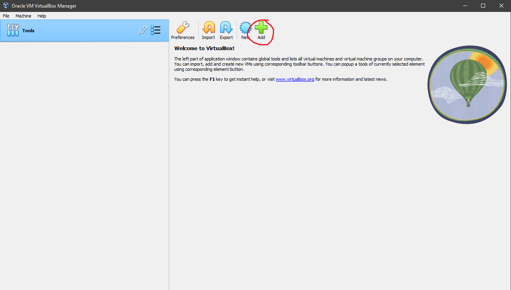

# Virtual Machines
{: .no_toc }

## Table of contents
{: .no_toc .text-delta }

1. TOC
{:toc}

---

## What is a Virtual Machine?

A virtual machine is a virtual environment that functions as its own computer, complete with its own CPU, memory, networking, and storage. You can think of them as simulations of computers. Technically, you can even go as far as to create virtual machines within virtual machines within virtual machines, and so on as long as you have enough computational resources. By using a virtual machine, you can create a simulation of a computer running the Linux operating system, and develop inside of it. 

---

## Requirements

You will need to download [ubuntu] desktop and [virtualbox] respectively. 

---

## Steps

### Create a Virtual Machine

Start by launching virtualbox. To launch a new virtual machine, click the add button at the top.

---

### Select the Ubuntu ISO

Be sure to name your virtual machine, and for the ISO select the ubuntu desktop ISO you downloaded previously. Then, continue with the process. 

---

### Configuration

You will be asked to create a username and password. This will be the administrator account, or the superuser. Additionally, you can tweak how much memory, disk space, and cpu cores the virtual machine can use. Note that if you give too little resources, the virtual machine may fail to initialize. If at any point in the initialization process the virtual machine fails, try allocating more resources.

---

### Accessing the Virtual Machine

The virtual machine should open in a new window. After the initialization process finishes, you can login with the username and password you created. To access the command line, click the icon in the bottom left and search for "terminal".

---

## Alternative Guides

You can check an official guide for creating a virtual machine from the [Ubuntu] website.

[Ubuntu]: https://ubuntu.com/tutorials/how-to-run-ubuntu-desktop-on-a-virtual-machine-using-virtualbox#1-overview
[ubuntu]: https://ubuntu.com/download/desktop
[virtualbox]: https://www.virtualbox.org/